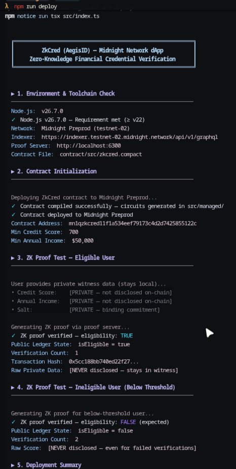

<div align="center">
  
# ZkCred (AegisID)

> Privacy-preserving zero-knowledge financial eligibility and credit credential gate built on Midnight Network using Compact smart contracts, client-side proving, and MongoDB audit persistence.

[](LICENSE)
[-blue.svg)](https://midnight.network)
[](https://docs.midnight.network)
[](https://zk-cred.vercel.app)
[](https://www.youtube.com/watch?v=Fff9AX6rdYM)

</div>

---

## ✅ Submission Checklist

The submission requirements have been reviewed and verified against the current project repository.

| Requirement                                       |     Status    | Evidence / Verification                                                                                                           |
| :------------------------------------------------ | :-----------: | :-------------------------------------------------------------------------------------------------------------------------------- |
| **Public GitHub Repository**                      |   ✅ Complete  | 🔗 [View ZkCredential Repository](https://github.com/smritiadhikari7/ZkCredential)                                                |
| **Complete README & Setup Instructions**          |   ✅ Complete  | 📚 Comprehensive setup, environment configuration, architecture, usage, and privacy documentation                                 |
| **Successful Circuit Compilation Screenshot**     |  ✅ Complete |  [Successful Circuit Compilation](#verification--test-evidence) successful circuit compilation output |
| **Contract Deployment Screenshot**                |   ✅ Complete  | 📸 `assets/npm_run_deploy.png` shows successful deployment output with contract address                                           |
| **Public State vs Private Witness Documentation** |   ✅ Complete  | 🔐 Documented in the Privacy Model section, including public and private data boundaries                                          |
| **Initial Product Idea**                          |   ✅ Complete  | 💡 Privacy-preserving multi-attribute financial eligibility gate for DeFi                                                         |
| **Live Demo**                                     |   ✅ Complete  | 🌐 [Launch ZkCredential](https://zk-cred.vercel.app)                                                                              |
| **Preprod Contract Deployment**                   |   ✅ Complete  | 🔗 Contract ID: `a95f0d061323e6c1568e39344bcbae6d559e58c4bd6df335dc5c20de81a6f2b6`                                                |
| **Demo Video**                                    |   ✅ Complete  | 🎥 [Watch ZkCredential Demo](https://www.youtube.com/watch?v=Fff9AX6rdYM)                                                         |
| **Wallet Connection & Circuit Flow**              |   ✅ Complete  | 🔐 Demo walkthrough includes wallet interaction and the project circuit flow                                                      |
| **Privacy Claim Documentation**                   |   ✅ Complete  | 🛡️ Documents zero-knowledge witness containment, client-side PLONK proving, and fail-closed `410 Gone` `/api/proof` behavior     |
| **3+ Passing Tests**                              |   ✅ Complete  | 🧪 `assets/npm_test.png` confirms **14 passing unit tests** in `tests/zkcred.test.ts`                                             |
| **Privacy Model**                                 |   ✅ Complete  | 🔒 Dedicated `## Privacy Model` section explains what an observer can and cannot learn                                            |
| **Meaningful Git Commits**                        |   ✅ Complete  | 📝 **28 meaningful development commits** verified in Git history                                                                  |
| **CI/CD Pipeline**                                |  ❌ Incomplete | ⚙️ No `.github/workflows` directory or configured CI/CD pipeline found                                                            |
| **Full-Functionality Demo**              | ✅ Complete | 🎥 [Watch Demo](https://www.youtube.com/watch?v=Fff9AX6rdYM)                    |
| **Approved Product Proposal**                     |  ❌ Incomplete | 📋 No product proposal submission/approval evidence found in the repository                                                       |

> **Submission Status:** ✅  **🌒 Moonshots Level 1 → 3 requirements completed**
>
> ZkCredential includes a public GitHub repository, complete documentation, local setup instructions, live deployment, deployed Midnight Preprod contract, privacy model, working circuit/test evidence, 14 passing tests, 28 meaningful commits, and a project demo video. Remaining gaps are the successful circuit compilation screenshot, CI/CD workflow, verifiable 1-minute demo duration, and external product proposal approval evidence.

---

## Demo

- **Official Demo Video**: [Watch the Demo](https://www.youtube.com/watch?v=Fff9AX6rdYM)
- **Production Web Application (Vercel)**: [https://zk-cred.vercel.app](https://zk-cred.vercel.app)
- **Production API Server (Render)**: [https://zkcred-api.onrender.com](https://zkcred-api.onrender.com)
- **Midnight Preprod GraphQL Indexer**: [https://indexer.preprod.midnight.network/api/v3/graphql](https://indexer.preprod.midnight.network/api/v3/graphql)

### Verified Deployed Preprod Contract
```text
Network: Midnight Preprod (testnet-02)
Contract Address: a95f0d061323e6c1568e39344bcbae6d559e58c4bd6df335dc5c20de81a6f2b6
Initialization Tx: 0044ac4d7ec9c41c79dbbf45385e5c1a70237693c1c6d03b1440103e0354c99d6f
```

### Verification & Test Evidence
The repository contains real execution evidence in `assets/`:

| Test Suite Execution (14 Passed) | Interactive CLI Deployment Output |
|:---:|:---:|
|  |  |

---

## Overview

### The Problem
Traditional loan, mortgage, and DeFi underwritings require applicants to surrender complete, unredacted financial dossiers—exact income statements, precise credit scores, birth dates, and identity records. Entrusting these sensitive records to centralized databases exposes borrowers to identity theft, predatory scraping, and catastrophic data breaches.

### The Solution
**ZkCred (AegisID)** eliminates unnecessary data disclosure by implementing a multi-attribute financial eligibility gate powered by Zero-Knowledge SNARKs (PLONK) on the **Midnight Network**. Borrowers prove off-chain that their financial and identity credentials satisfy or exceed lender-defined minimum thresholds (e.g., credit score &ge; 700, annual income &ge; $50,000, age &ge; 21) without revealing their actual numbers.

### Target Users
- **DeFi Lending Protocols & Underwriters**: Verify borrower creditworthiness and compliance without holding custody of regulated personally identifiable information (PII).
- **Privacy-Conscious Borrowers**: Prove solvency and credit fitness directly from their browser and web3 wallet without leaking sensitive net worth or personal age data.
- **FinTech & Web3 Compliance Gates**: Enforce age and liquidity gates with on-chain selective disclosure and cryptographically guaranteed replay protection.

---

## Features

### 1. Multi-Attribute Compact Zero-Knowledge Circuit (`zkcred.compact`)
- **Private Witness Inputs**: Evaluates three private user attributes (`creditScore`, `annualIncome`, `age`) along with an ephemeral private `salt` inside a client-side PLONK ZK circuit.
- **Selective Disclosure**: Only discloses a single boolean outcome (`isEligible = disclose(eligible)`) and an updated verification counter (`verificationCount`) to the public ledger. Raw credit scores, incomes, and ages are never exposed.
- **Replay Protection via Domain-Separated Nullifiers**: Derives a public nullifier `persistentHash(["zkcred:eligibility:nullifier:v1", salt])` and enforces uniqueness on-chain through `usedSaltNullifiers: Set<Bytes<32>>`. Attempts to reuse the same credential salt fail closed without revealing the underlying salt.
- **Admin Governance Circuit**: The contract creator initializes an authorized `admin` address. Authorized admins can call `updateThresholds` to adjust minimum credit score, income, or age requirements.
- **State Query Circuit**: Lightweight `getEligibilityStatus()` circuit for verifying current gate state.

### 2. Client-Side Proving & Wallet Integration (`ui/midnight-client.ts`)
- **Midnight Lace Integration**: Interacts with the official Midnight Lace wallet via the `window.midnight.mnLace` DApp connector interface.
- **Pure Local Proving**: Generates ZK-SNARK proofs locally via the Midnight Proof Server container (`http://localhost:6300`). Private witness values never leave the user's browser runtime.
- **WASM & Verifier Validation**: Automatically checks on-chain verifier keys against locally compiled contract assets prior to proving (`findDeployedContract`).
- **In-Browser Contract Deployment & Admin Key Storage**: Enables interactive contract deployment through Lace and securely preserves the 32-byte administrator witness in browser `localStorage`.

### 3. Verification Studio UI (`ui/index.html`, `ui/app.js`, `ui/style.css`)
- **Interactive Verification Studio**: Real-time sliders for Credit Score (300–850), Annual Income ($0–$500,000), and Age (18–100) with dynamic UI eligibility evaluation before proof submission.
- **Live On-Chain State Synchronizer**: Directly queries the Midnight Preprod GraphQL Indexer to display live contract parameters and total on-chain verifications.
- **Audit Logging & Cryptographic Attestation**: Export verifiable verification receipts (JSON attestation with transaction hash, nullifier commitment, and timestamps).
- **Administrative Control Panel**: Unlocks threshold modification controls when the active browser holds the deployed contract's admin key.
- **Proof Server Health Diagnostics**: Detects whether the local Docker proof server is online and displays a setup modal with actionable terminal commands.

### 4. Dual-Runtime Backend & Persistent Authentication (`server/`, `api/`)
- **Standalone Express Server (`server/index.js`)**: Production-ready ESM server deployed on Render.
- **Vercel Serverless API (`api/index.js`)**: CommonJS serverless adapter deployed on Vercel.
- **Hybrid Authentication**:
  - Manual email/password registration with `bcryptjs` hashing (10 salt rounds) and signed 7-day JWT tokens.
  - Google OAuth 2.0 Authorization Code flow with popup-based postMessage communication.
- **MongoDB Atlas Integration**:
  - `User` collection storing profile metadata, linked wallet addresses, verification counts, and verified badge flags (`creditScoreVerified`, `incomeVerified`, `ageVerified`).
  - `Verification` collection auditing all completed proofs with transaction hashes and eligibility outcomes.
- **Fail-Closed Architecture**: The `/api/proof` endpoint is permanently disabled (`410 Gone`), guaranteeing that the backend API can never accept or process private witness data.

---

## Tech Stack

| Category | Technology | Purpose |
|---|---|---|
| **Smart Contracts / ZK** | Compact (`v0.26` / `v0.31` compiler) | Privacy smart contract DSL, ZKIR circuits, and ledger schemas |
| **Blockchain** | Midnight Network Preprod (`testnet-02`) | Privacy-centric Layer-1 with dual public/shielded state model |
| **Proof System** | PLONK ZK-SNARKs | Proof generation via Dockerized Midnight Proof Server (`port 6300`) |
| **Wallet Connector** | Midnight Lace Wallet (`@midnight-ntwrk/dapp-connector-api`) | Shielded coin and encryption key management, tx signing |
| **SDK / Runtime** | `@midnight-ntwrk/compact-runtime`, `@midnight-ntwrk/ledger-v8`, `@midnight-ntwrk/midnight-js-*` | Contract orchestration, state providers, and balancing |
| **Frontend** | HTML5, Vanilla JavaScript (ES Modules), Custom Glassmorphic CSS | UI interface, interactive sliders, WebGL canvas sculpture |
| **Build Tool** | Vite 6.1, `vite-plugin-wasm`, `vite-plugin-static-copy` | Browser bundling, WASM support, proving key copying |
| **Backend** | Node.js, Express 5.2 | REST API, OAuth redirect handling, indexer proxy |
| **Database** | MongoDB Atlas via Mongoose 9.9 | User accounts, profile metadata, audit trail logging |
| **Authentication** | JWT (`jsonwebtoken`), `bcryptjs`, Google OAuth 2.0 | User credential management and session validation |
| **Hosting & Infra** | Vercel (UI + Serverless Functions), Render (API Server), Docker | Frontend and backend deployment pipelines |
| **Testing** | Jest 29, `ts-jest` | Automated unit tests for contract circuits and privacy rules |

---

## Architecture

```mermaid
flowchart TD
    subgraph ClientBrowser["User Browser (Client-Side Privacy Boundary)"]
        UI["Verification Studio UI<br/>(Sliders & Input)"]
        PrivateWitness["Private Witness Memory<br/>• Credit Score (e.g. 760)<br/>• Annual Income (e.g. $90k)<br/>• Age (e.g. 26)<br/>• Random Salt (32 bytes)"]
        ClientAdapter["Midnight Client Adapter<br/>(midnight-client.ts)"]
        LocalProver["Local Proof Server<br/>(Docker localhost:6300)"]
        LaceWallet["Midnight Lace Wallet<br/>(Balance & Sign TX)"]
    end

    subgraph MidnightNetwork["Midnight Network (Preprod testnet-02)"]
        Ledger["Public Ledger State<br/>• minCreditScore: Uint<32><br/>• minAnnualIncome: Uint<64><br/>• minAge: Uint<32><br/>• isEligible: Boolean<br/>• usedSaltNullifiers: Set<Bytes<32>>"]
        Indexer["Midnight GraphQL Indexer<br/>(indexer.preprod.midnight.network)"]
    end

    subgraph BackendInfrastructure["Backend & Data Storage"]
        API["Express API Server<br/>(Render / Vercel Serverless)"]
        Mongo[("MongoDB Atlas<br/>• Users & Badges<br/>• Verification Audit Logs")]
        GoogleAuth["Google OAuth 2.0 API"]
    end

    UI -->|Witness Input| PrivateWitness
    PrivateWitness -->|In-Memory Closures| ClientAdapter
    ClientAdapter <-->|PLONK ZK Proving Request| LocalProver
    ClientAdapter <-->|Serialize & Sign| LaceWallet
    LaceWallet -->|Submit Transaction| Ledger
    Ledger -->|Index Block Events| Indexer
    Indexer -->|GraphQL Query| API
    Indexer -->|WebSocket / HTTP Query| ClientAdapter
    API -->|Persist Audit Record| Mongo
    API <-->|OAuth Code Exchange| GoogleAuth
    UI -->|POST /api/verifications<br/>(Public Tx Hash & Disclosed Flag ONLY)| API
```

---

## Privacy Model

ZkCred enforces a strict cryptographic privacy boundary. The core rule is: **no raw financial data or identity attributes ever touch the public blockchain or backend servers.**

### 1. What Information is Public
The following data fields exist on the public Midnight ledger and are visible to anyone querying the indexer:
- **`minCreditScore` (`Uint<32>`)**: The minimum required credit score threshold set by the contract.
- **`minAnnualIncome` (`Uint<64>`)**: The minimum annual income threshold (stored in cents).
- **`minAge` (`Uint<32>`)**: The minimum required age threshold.
- **`isEligible` (`Boolean`)**: The boolean outcome of the most recently executed verification (`true` or `false`).
- **`verificationCount` (`Uint<64>`)**: A public monotonic counter incremented by 1 on every valid verification.
- **`admin` (`Bytes<32>`)**: The 32-byte public key/address of the authorized contract administrator.
- **`usedSaltNullifiers` (`Set<Bytes<32>>`)**: Public 32-byte cryptographic nullifier commitments representing spent proofs.

### 2. What Information Remains Private
The following inputs remain strictly off-chain inside client-side browser memory closures and are consumed only during local PLONK proof generation:
- **`creditScore` (`Uint<32>`)**: The user's actual, unrounded credit score (e.g., 760).
- **`annualIncome` (`Uint<64>`)**: The user's exact gross annual income (e.g., $95,400).
- **`age` (`Uint<32>`)**: The user's exact age (e.g., 26).
- **`userSalt` (`Bytes<32>`)**: An unrevealed 32-byte random cryptographic salt used to derive the nullifier.
- **`adminKey` (`Bytes<32>`)**: The private secret key required to authenticate administrator threshold updates.

### 3. What an Observer Can Learn
An external observer inspecting the blockchain or public indexer can determine:
1. That a verification transaction occurred at a specific block height and timestamp.
2. The sender's public Midnight address that funded and submitted the transaction.
3. Whether the transaction was successful (`isEligible = true`) or unsuccessful (`isEligible = false`).
4. That the user's attributes satisfied all three thresholds simultaneously (if `isEligible = true`).
5. The public nullifier hash added to `usedSaltNullifiers` to ensure replay prevention.

### 4. What an Observer Cannot Learn
An external observer CANNOT determine:
1. The user's exact credit score (e.g., whether it was 701 or 845).
2. The user's exact annual income (e.g., whether they earn $55,000 or $500,000).
3. The user's exact birthdate or age (e.g., whether they are 22 or 65).
4. Which specific attribute caused a failure if `isEligible = false`.
5. The original unhashed salt used in the credential proof.
6. Any link between multiple proofs submitted with different fresh salts.

### 5. What is Revealed by On-Chain Transactions
- **Transaction Metadata**: Standard Midnight transaction envelope (transaction ID, block height, fees).
- **Circuit Invoked**: The identifier `verifyEligibility`.
- **Public Disclosures**: The `disclose()` statements in `zkcred.compact`:
  ```compact
  isEligible = disclose(eligible);
  verificationCount = disclose(newCount);
  usedSaltNullifiers.insert(disclose(saltNullifier));
  ```

### 6. What is Kept in the Private Witness
All private inputs are defined via the `witness` primitive in Compact:
```compact
witness getPrivateCreditScore(): Uint<32>;
witness getPrivateAnnualIncome(): Uint<64>;
witness getPrivateAge(): Uint<32>;
witness getPrivateSalt(): Bytes<32>;
```
In `ui/midnight-client.ts`, witness callbacks return values directly from in-memory JavaScript variables. These are serialized directly into the local prover wire protocol and discarded from memory upon completion.

---

## Project Structure

```text
ZkCredential/
├── api/                             # Vercel serverless function entrypoint
│   ├── index.js                     # Express app configured for Vercel serverless export (CommonJS)
│   └── package.json                 # Declares type: commonjs for serverless bundle
├── assets/                          # Static project badges and test/deploy terminal screenshots
│   ├── logo.svg                     # Official AegisID / ZkCred vector logo
│   ├── npm_compile.png              # Screenshot of contract compilation
│   ├── npm_run_deploy.png           # Screenshot of terminal contract deployment flow
│   └── npm_test.png                 # Screenshot of passing Jest test run (14 tests)
├── contract/                        # Midnight Compact smart contract workspace
│   ├── package.json                 # Workspace definition for Compact contract
│   └── src/
│       └── zkcred.compact           # Compact smart contract defining circuits, witnesses, and ledger state
├── server/                          # Standalone Node.js Express server
│   ├── index.js                     # Production Express server (ES Modules) with MongoDB and OAuth
│   └── local.js                     # Local dev runner serving static UI and API simultaneously
├── src/
│   └── managed/                     # Compiled Compact artifacts (generated by compact compile)
│       ├── compiler/
│       │   └── contract-info.json   # Compiled circuit signatures and ledger storage layout
│       ├── contract/                # TypeScript runtime interfaces and JavaScript binding
│       │   ├── index.d.ts
│       │   ├── index.js
│       │   └── index.js.map
│       ├── index.ts                 # Bridge export providing LedgerState, Circuits, and Witness types
│       └── keys/                    # Compiled prover and verifier key assets
│           ├── getEligibilityStatus.prover / .verifier
│           ├── initialize.prover / .verifier
│           ├── updateThresholds.prover / .verifier
│           └── verifyEligibility.prover / .verifier
├── tests/                           # Unit and privacy boundary tests
│   └── zkcred.test.ts               # Jest test suite for circuit logic and nullifier replay assertions
├── ui/                              # Web frontend interface
│   ├── app.js                       # Frontend business logic, state store, UI updates, and API client
│   ├── crypto-shim.ts               # Browser crypto shims for Vite rollup build
│   ├── favicon.svg                  # Vector browser favicon
│   ├── index.html                   # Main single-page application markup (Hero, Studio, Dashboard, FAQ)
│   ├── midnight-client.ts           # Midnight JS adapter orchestrating Lace wallet, providers, and proving
│   └── style.css                    # Glassmorphism design system, dark palette, animations, and typography
├── docker-compose.yml               # Local Docker configuration for the Midnight Proof Server container
├── render.yaml                      # Render Infrastructure-as-Code deployment blueprint
├── vercel.json                      # Vercel deployment configuration and API rewrites
├── vite.config.ts                   # Vite configuration with WASM plugin and key asset copying
├── tsconfig.json                    # TypeScript compiler options
└── package.json                     # NPM scripts, dependencies, and workspace definitions
```

---

## How It Works

```text
┌───────────────────────────────────────────────────────────────────────────────────┐
│                           END-TO-END VERIFICATION FLOW                            │
└───────────────────────────────────────────────────────────────────────────────────┘

 1. USER AUTHENTICATION & SETUP
    └─► User creates an account or signs in via Google OAuth 2.0.
    └─► Profile is retrieved from MongoDB via JWT bearer authorization.

 2. WALLET CONNECTION
    └─► User connects Midnight Lace Wallet in Preprod (testnet-02) mode.
    └─► Application initializes MidnightJS providers and verifies on-chain verifier keys.

 3. LOCAL WITNESS INGESTION
    └─► User adjusts Credit Score, Annual Income, and Age sliders.
    └─► Raw values are held strictly in browser JavaScript closures; NEVER sent to any API.
    └─► A fresh 32-byte cryptographic salt is generated for this verification attempt.

 4. ZERO-KNOWLEDGE PROVING (OFF-CHAIN)
    └─► DApp triggers `verifyEligibility` circuit via Midnight client.
    └─► Local Docker Proof Server (localhost:6300) computes the PLONK ZK-SNARK proof.
    └─► Circuit computes persistentHash(["zkcred:eligibility:nullifier:v1", salt]).
    └─► Circuit evaluates thresholds: (score >= minScore && income >= minIncome && age >= minAge).

 5. ON-CHAIN SELECTIVE DISCLOSURE (MIDNIGHT LEDGER)
    └─► Midnight Lace signs and submits the balanced transaction.
    └─► Circuit records:
        • isEligible = disclose(eligible)
        • verificationCount = disclose(verificationCount + 1)
        • usedSaltNullifiers.insert(disclose(saltNullifier))
    └─► Transaction is confirmed on the Midnight Preprod blockchain.

 6. AUDIT LOGGING & ATTESTATION
    └─► DApp captures the confirmed transaction hash and public boolean result.
    └─► Posts public audit record to POST /api/verifications.
    └─► MongoDB updates user's verification history and awards credential badges.
    └─► User downloads or views cryptographic attestation receipt.
```

---

## Getting Started

### Prerequisites
- **Node.js**: `v22.x` or higher
- **Docker Desktop**: Required to run the local Midnight Proof Server container
- **Midnight Lace Wallet**: Chrome/Brave extension set to **Midnight Preprod (testnet-02)**
- **MongoDB Atlas Cluster**: Required for user accounts and audit logging
- **Google Cloud Console Credentials** *(Optional)*: Required only if testing Google OAuth 2.0

---

### Step 1: Clone Repository & Install Dependencies

```bash
git clone https://github.com/smritiadhikari7/ZkCredential.git
cd ZkCredential
npm install
```

---

### Step 2: Configure Environment Variables

Create a `.env` file in the project root based on `.env.example`:

```bash
cp .env.example .env
```

Populate the required values:

```env
# ─── Auth & JWT ─────────────────────────────────────────────────────────────
JWT_SECRET=your_super_secret_jwt_key_change_this_in_production

# ─── MongoDB Atlas ──────────────────────────────────────────────────────────
MONGODB_URI=mongodb+srv://<username>:<password>@<cluster>.mongodb.net/zkcred

# ─── Google OAuth 2.0 (Optional) ─────────────────────────────────────────────
GOOGLE_CLIENT_ID=your_google_client_id.apps.googleusercontent.com
GOOGLE_CLIENT_SECRET=your_google_client_secret
GOOGLE_REDIRECT_URI=http://localhost:3000/api/auth/google/callback

# ─── Server Port ────────────────────────────────────────────────────────────
PORT=3000

# ─── Midnight Network ────────────────────────────────────────────────────────
CONTRACT_ADDRESS=a95f0d061323e6c1568e39344bcbae6d559e58c4bd6df335dc5c20de81a6f2b6
MIDNIGHT_INDEXER_URL=https://indexer.preprod.midnight.network/api/v3/graphql

# ─── Proof Server ───────────────────────────────────────────────────────────
PROOF_SERVER_URL=http://localhost:6300
```

---

### Step 3: Launch the Local Midnight Proof Server

Midnight ZK-SNARK proving requires the official Midnight Proof Server container:

```bash
docker compose up -d
```

Verify that the container is healthy:

```bash
curl http://localhost:6300/health
```

> **Important Lace Wallet Setup**:
> Open Midnight Lace Wallet &rarr; **Settings** &rarr; **Network** &rarr; Set **Proof Server URL** to `http://localhost:6300`. This ensures Lace utilizes your local prover container instead of hitting remote payload limitations.

---

### Step 4: Run Locally

You can run the full application using any of the following methods:

#### Option A: Unified Local Development Server (Recommended)
Runs both the API endpoints and the static UI on port `3000`:
```bash
npm run dev:local
```
Navigate to: `http://localhost:3000`

#### Option B: Vite Frontend Dev Server
Runs the Vite development server with hot-module reloading on port `5173`:
```bash
npm run ui
```
Navigate to: `http://localhost:5173` *(Proxies `/api` requests to production Render backend or local server)*

#### Option C: Standalone Backend Server
Runs the production Express server on port `4000` (or `PORT` from `.env`):
```bash
npm run server
```

---

## Available Scripts

| Script | Command | Purpose |
|---|---|---|
| `npm run compile` | `compact compile contract/src/zkcred.compact src/managed` | Compiles the Compact contract into circuits, ZKIR, and TypeScript bindings |
| `npm run build` | `tsc` | Runs the TypeScript compiler across `src/` |
| `npm test` | `node --experimental-vm-modules node_modules/.bin/jest --forceExit` | Runs the Jest test suite in ESM mode |
| `npm run deploy` | `tsx src/index.ts` | CLI script entry for contract deployment *(Note: see Limitations)* |
| `npm run server` | `node server/index.js` | Starts the standalone Express API server |
| `npm start` | `node server/index.js` | Production start command (aliased to `npm run server`) |
| `npm run ui` | `vite --host 0.0.0.0` | Starts the Vite UI development server |
| `npm run ui:build` | `vite build` | Builds the production frontend bundle into `ui/dist` |
| `npm run dev` | `vercel dev --listen 3000` | Starts local Vercel development runtime |
| `npm run dev:local` | `node server/local.js` | Runs local server combining API routes and static UI |
| `npm run vercel:deploy` | `vercel --prod` | Triggers a production deployment to Vercel |

---

## API Documentation

All API routes are served under `/api`:

| Method | Endpoint | Auth Required | Description |
|---|---|:---:|---|
| `POST` | `/api/auth/register` | No | Registers a new user with `name`, `email`, `password`, and optional `walletAddress`. Returns JWT and profile. |
| `POST` | `/api/auth/login` | No | Authenticates an existing user via `email` and `password`. Returns JWT and profile. |
| `GET` | `/api/auth/google/redirect` | No | Generates and redirects to the Google OAuth 2.0 consent authorization URL. |
| `GET` | `/api/auth/google/callback` | No | Handles OAuth code exchange, upserts user in MongoDB, and returns JWT to the opener window. |
| `GET` | `/api/auth/profile` | **Yes** (Bearer JWT) | Returns the complete authenticated MongoDB user profile. *(Alias: `/api/auth/me`)* |
| `PUT` | `/api/auth/profile` | **Yes** (Bearer JWT) | Updates user profile metadata (`name`, `displayName`, `firstName`, `lastName`, `locale`, `avatarUrl`, `walletAddress`). |
| `PUT` | `/api/auth/wallet` | **Yes** (Bearer JWT) | Links or updates the connected Midnight wallet address on the user profile. |
| `POST` | `/api/verifications` | **Yes** (Bearer JWT) | Persists an on-chain verification audit log (`contractAddress`, `circuit`, `isEligible`, `verificationCount`, `transactionHash`). |
| `GET` | `/api/verifications` | **Yes** (Bearer JWT) | Retrieves the 50 most recent verification audit logs for the authenticated user. |
| `GET` | `/api/verifications/count` | **Yes** (Bearer JWT) | Returns the total count of verifications completed by the authenticated user. |
| `GET` | `/api/contract/state` | No | Proxies a GraphQL query to the Midnight Preprod Indexer and returns live on-chain contract state. |
| `POST` | `/api/proof` | N/A | **Disabled by design (HTTP 410 Gone)**. Rejects witness submissions to preserve client-side privacy. |
| `GET` | `/api/health` | No | Returns system health, MongoDB status, proof server URL, contract address, and indexer endpoint. |

---

## Database

The project uses **MongoDB Atlas** via Mongoose models defined in `server/index.js` and `api/index.js`:

### 1. `User` Model
Stores authenticated account data and credential attestations:
```javascript
{
  name: { type: String, required: true },
  firstName: { type: String, default: "" },
  lastName: { type: String, default: "" },
  displayName: { type: String, default: "" },
  email: { type: String, required: true, unique: true },
  emailVerified: { type: Boolean, default: false },
  passwordHash: { type: String },
  avatarUrl: { type: String },
  googleId: { type: String },
  authProvider: { type: String, enum: ["manual", "google"], default: "manual" },
  locale: { type: String, default: "" },
  walletAddress: { type: String, default: null },
  proofCount: { type: Number, default: 0 },
  verifiedCredentials: {
    creditScoreVerified: { type: Boolean, default: false },
    incomeVerified: { type: Boolean, default: false },
    ageVerified: { type: Boolean, default: false },
  },
  createdAt: { type: Date, default: Date.now }
}
```

### 2. `Verification` Model
Stores tamper-evident audit records of completed on-chain proofs:
```javascript
{
  userId: { type: String, required: true },
  userEmail: { type: String },
  contractAddress: { type: String, required: true },
  circuit: { type: String, default: "verifyEligibility" },
  isEligible: { type: Boolean, required: true },
  verificationCount: { type: Number, required: true },
  transactionHash: { type: String, required: true },
  timestamp: { type: Date, default: Date.now }
}
```

---

## Authentication & Security

1. **Client-Side Witness Boundary**:
   The backend API never receives, inspects, or logs raw financial credentials. Endpoint `POST /api/proof` explicitly returns `410 Gone`:
   ```json
   { "error": "Proof generation is wallet-local. This API never accepts private witnesses." }
   ```
2. **Cryptographic Password Hashing**:
   Manual passwords are encrypted using `bcryptjs` with a cost factor of 10 rounds before saving to MongoDB.
3. **Session Token Security**:
   Authenticated sessions issue signed JSON Web Tokens (JWT) with 7-day expiration validated via an `authMiddleware` gate.
4. **Fail-Closed Architecture**:
   If MongoDB is unreachable or `JWT_SECRET` is unset, protected auth and verification endpoints reject requests with HTTP 503 rather than falling back to unencrypted in-memory stores.
5. **CORS Whitelist**:
   Strict CORS origins allow requests only from verified deployment domains (`https://zk-cred.vercel.app`, `*.vercel.app`, `*.onrender.com`) and local development ports.

---

## Blockchain / Smart Contracts

### Midnight Network Details
- **Network**: Midnight Preprod Testnet (`testnet-02`)
- **Language**: Compact v0.26 (Compiled via Compact compiler v0.31.0)
- **Deployed Contract Address**: `a95f0d061323e6c1568e39344bcbae6d559e58c4bd6df335dc5c20de81a6f2b6`
- **Deployment Transaction**: `0044ac4d7ec9c41c79dbbf45385e5c1a70237693c1c6d03b1440103e0354c99d6f`

### Public Ledger State
```compact
export ledger minCreditScore: Uint<32>;
export ledger minAnnualIncome: Uint<64>;
export ledger minAge: Uint<32>;
export ledger isEligible: Boolean;
export ledger verificationCount: Uint<64>;
export ledger admin: Bytes<32>;
export ledger usedSaltNullifiers: Set<Bytes<32>>;
```

### Circuits & Witness Ingestion
- `initialize(creditScoreThreshold, annualIncomeThreshold, ageThreshold, adminAddress)`: Constructor circuit configuring initial public thresholds and storing the admin identity commitment.
- `verifyEligibility()`: Ingests private witnesses (`creditScore`, `annualIncome`, `age`, and `salt`), asserts non-membership in `usedSaltNullifiers`, checks all thresholds, and selectively discloses `isEligible` and the incremented `verificationCount`.
- `updateThresholds(newMinCreditScore, newMinAnnualIncome, newMinAge)`: Checks the private caller key against `admin` ledger state (`assert(callerKey == admin)`), updating thresholds and resetting `isEligible` to `false`.
- `getEligibilityStatus()`: Query circuit returning current `isEligible` boolean.

### In-Browser Contract Deployment
Users can deploy fresh contract instances directly through their connected Lace wallet:
```javascript
await window.ZkCredMidnight.deploy({
  minCreditScore: 700,
  minAnnualIncome: 5000000, // Cents ($50,000)
  minAge: 21,
});
```

---

## Testing

The test suite in `tests/zkcred.test.ts` validates:
1. **Compact Privacy Model**: Asserts that raw scores, incomes, and ages are private witnesses and never disclosed to public state.
2. **Replay Nullifier Guarantees**: Asserts that domain-separated nullifiers prevent reusing the same credential salt.
3. **Selective Disclosure Rules**: Asserts that only the boolean outcome and count are disclosed.
4. **Prover Key Integrity**: Verifies presence of `.prover` proving keys in `src/managed/keys/`.
5. **Runtime Circuit Execution**: Instantiates the generated Compact runtime (`Contract`) and asserts successful execution and expected assertion throws on replayed salts or unauthorized admin updates.

Run tests with:
```bash
npm test
```

---

## Limitations & Known Issues

1. **CLI Deployment Script Missing**:
   The script `"deploy": "tsx src/index.ts"` declared in `package.json` references `src/index.ts`, which is currently omitted from the repository. Contract deployment is fully implemented and supported through the web client via `ZkCredMidnight.deploy()` in `ui/midnight-client.ts`.
2. **Test Helper Imports**:
   `tests/zkcred.test.ts` imports helper functions from `../src/api.js` and expects `.bzkir` files in `src/managed/zkir/`. In the current repository state, running `npm test` requires restoring `src/api.ts` or stubbing these utility imports.
3. **Local Proof Server Dependency**:
   Because public remote proof servers often throttle or reject large ZK payloads, reliable proof generation requires running the local Docker container (`docker compose up -d`) and pointing Lace to `http://localhost:6300`.
4. **Admin Key Storage**:
   The 32-byte secret administrator key generated during in-browser contract deployment is stored in `localStorage`. Clearing browser data or changing browsers will prevent the admin from calling `updateThresholds`.
5. **Preprod Testnet Specific**:
   The implementation is specifically targeted and configured for Midnight Preprod (`testnet-02`) and will not connect to other networks without reconfiguring indexer endpoints and network IDs.

---

## Roadmap

### Implemented
- [x] Multi-attribute Compact eligibility circuit (Credit Score, Income, Age)
- [x] Domain-separated nullifier replay protection (`persistentHash`)
- [x] Admin threshold update circuit with caller key assertion
- [x] Browser-based MidnightJS integration with Midnight Lace Wallet
- [x] Dual-runtime backend (Express ESM server + Vercel CJS serverless function)
- [x] MongoDB Atlas audit logging and JWT / Google OAuth 2.0 authentication
- [x] Verification Studio UI with live sliders and dynamic eligibility preview
- [x] Live on-chain contract state reader via GraphQL Indexer

### In Progress
- [ ] Direct in-browser attestation signing with Lace wallet identity
- [ ] Offline proving fallback for pure client-side WASM execution without Docker

### Planned
- [ ] Multi-party credential issuer verification (W3C Verifiable Credentials to Compact witness adapter)
- [ ] Tiered credit scoring gates (Silver / Gold / Platinum credit bands)
- [ ] Multi-sig administrative governance circuit for threshold adjustments

---

## Contributing

1. Fork the repository (`https://github.com/smritiadhikari7/ZkCredential.git`).
2. Create a dedicated feature branch:
   ```bash
   git checkout -b feature/your-feature-name
   ```
3. Commit your changes with conventional commit messages:
   ```bash
   git commit -m "feat: your feature summary"
   ```
4. Push to your branch and submit a Pull Request.

---

## License

This project is licensed under the **MIT License**. See the [LICENSE](LICENSE) file for details:

```text
Copyright (c) 2026 Sov-ereign
```

---

## Credits

- **Midnight Network Team**: For the Compact smart contract language, compiler toolchain, and MidnightJS SDKs.
- **Cardano / Midnight Lace Wallet**: For browser DApp connector infrastructure.
- **ZkCred (AegisID) Team**: Privacy architecture, Compact circuits, and web application design.
