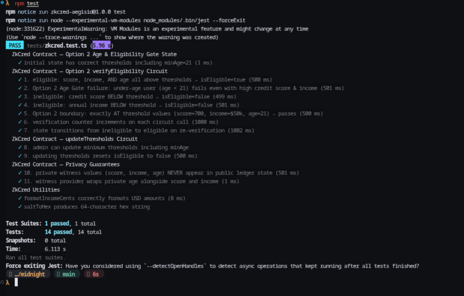

# AegisID — ZkCred

[](https://github.com/Sov-ereign/ZkCred/actions/workflows/ci.yml)

**Live demo:** [zk-cred.vercel.app](https://zk-cred.vercel.app) · **Product X:** [@ZK_CRED](https://x.com/ZK_CRED) · **Demo video (v2):** [watch on YouTube](https://youtu.be/Fff9AX6rdYM)

## 🏆 Level 6 Verification & Submission Deliverables

- 🌐 **Live Web Application**: [https://zk-cred.vercel.app](https://zk-cred.vercel.app)
- 👥 **70 Verifiable Preprod User Wallets**: [`ADDRESSES.md`](./ADDRESSES.md) *(List of 70 Midnight Preprod user wallet addresses)*
- 💬 **Documented Feedback Loop**: [`FEEDBACK.md`](./FEEDBACK.md) *(Synthesis of 70-user survey ratings, friction points, and code iterations)*
- 📊 **Raw Survey Response Dataset**: [`feedback_responses.csv`](./feedback_responses.csv) *(Google Form export dataset — 70 responses)*
- 🎥 **Demo Video Walkthrough**: [Watch on YouTube](https://youtu.be/Fff9AX6rdYM)
- 💻 **Commit History**: 124+ meaningful commits on `main` branch (exceeds 30 minimum requirement)

ZkCred is a Midnight Compact dApp for proving an age, credit-score, and income threshold without putting those values on-chain. A user signs through Midnight Lace; the browser constructs the Compact transaction, retrieves proving material, and submits it through the wallet.

## Privacy model

The Compact contract has private witnesses for `age`, `creditScore`, `annualIncome`, and a 32-byte `salt`. The frontend closes over these values locally while the circuit is executed. They are not sent to the application API, indexer, or prover as JSON. Each successful proof stores a domain-separated, one-way salt nullifier in contract state; this prevents replay of the same credential secret without revealing the salt or making it reusable across protocols.

An observer can learn the contract thresholds, the final `isEligible` Boolean, the public verification counter, salt nullifiers, and transaction identifiers. An observer cannot learn the raw age, credit score, annual income, salt, or the circuit's private transcript.

The contract source is [zkcred.compact](contract/src/zkcred.compact). Its generated ZKIR and proving keys are under `src/managed/` and are copied into the production web build.

## ⚡ ZK Proof Generation & Local Setup Guide

You can generate and submit Zero-Knowledge Proofs directly on the live Vercel app ([https://zk-cred.vercel.app](https://zk-cred.vercel.app)) or on a local dev instance (`http://localhost:5173`)! 

> **Important**: You can connect your Midnight Lace Wallet seamlessly on Vercel with the default remote proof server (`https://proof-server.preprod.midnight.network`). However, when using the default remote server, the ZK proof architecture **may or may not work** depending on network traffic and payload limits. To **guarantee** 100% reliable Zero-Knowledge proof generation, configure your Lace Wallet Proof Server URL to `http://localhost:6300`.

### Setup Overview

| Configuration | Proof Server Setting in Lace Wallet | Lace Wallet Connect & Live State | ZK Proof Generation |
| :--- | :--- | :---: | :---: |
| **Default Remote** | `https://proof-server.preprod.midnight.network` | ✅ Connected | ⚠️ May or may not work (Payload limits) |
| **Configured Local Container** | `http://localhost:6300` | ✅ Connected | ⚡ **100% Guaranteed ZK Proving** |

---

### Quick 2-Step Setup

1. **Run the Midnight Proof Server Container**:
   Run the official Midnight proof server container on your machine:
   ```bash
   docker run -p 6300:6300 midnightnetwork/proof-server:3.0.0
   ```
   *(Verify it is running: `curl http://localhost:6300/health`)*

2. **Configure Midnight Lace Wallet Settings**:
   In your Midnight Lace Wallet browser extension:
   - Open **Settings** ➔ **Network**
   - Change **Proof Server URL** to `http://localhost:6300` (instead of `https://proof-server.preprod.midnight.network`)

3. **Generate & Submit ZK Proofs**:
   - Open **[https://zk-cred.vercel.app](https://zk-cred.vercel.app)** (or local `http://localhost:5173`).
   - Connect your Midnight Lace Wallet and click **Generate & Verify ZK Proof**.
   - Lace Wallet will communicate directly with your local container on port 6300 and submit the ZK proof on-chain to Midnight Preprod!

---

### Optional: Running Full Application Locally

Developers can also clone and run the entire dApp locally:

```bash
git clone https://github.com/Sov-ereign/ZkCred.git
cd ZkCred
npm install
npm run dev
```

## Status

The application is fail-closed. It does not create a fake proof, fake transaction ID, in-memory user, or default contract state.

The deployed Preprod verifier is configured in the browser and API defaults:

```text
Contract: a95f0d061323e6c1568e39344bcbae6d559e58c4bd6df335dc5c20de81a6f2b6
Initialization transaction: 0044ac4d7ec9c41c79dbbf45385e5c1a70237693c1c6d03b1440103e0354c99d6f
```

The app verifies the contract and every submitted transaction through Midnight Preprod's GraphQL indexer before showing a success state. A visitor can override the address only by deploying another compatible contract through Lace; no unverified address is trusted.

This is the V2 deployment, whose contract state was read successfully from the canonical Midnight Preprod GraphQL indexer after deployment. It includes replay-nullifier enforcement and the admin-authorized threshold circuit.

## Run locally

Prerequisites: Node 22+, Docker, Midnight Lace configured for Preprod, a funded Preprod account, MongoDB, and a Google OAuth client only if Google login is needed.

```bash
npm install
docker-compose up -d
curl --fail http://127.0.0.1:6300/health
cp .env.example .env
npm run ui
```

Open the Vite URL (normally `http://localhost:5173`). Do not open `ui/index.html` directly: the Midnight client must be bundled by Vite.

Set the following environment values in `.env` for the API server, and as environment variables in Vercel for a deployment:

```dotenv
JWT_SECRET=a-long-random-secret
MONGODB_URI=mongodb+srv://...
MIDNIGHT_INDEXER_URL=https://indexer.preprod.midnight.network/api/v3/graphql
CONTRACT_ADDRESS=a95f0d061323e6c1568e39344bcbae6d559e58c4bd6df335dc5c20de81a6f2b6
```

Start the API locally with `npm run server`. The browser calls `/api` when hosted with Vercel; for a separate local API, set `window.__RENDER_API__` before loading the page.

## Wallet and circuit flow

1. The user signs in. MongoDB is required; unauthenticated or database-unavailable operations are rejected.
2. The user connects Midnight Lace. The app polls the standard `window.midnight` connector map and invokes `InitialAPI.connect("preprod")`.
3. The browser gets the wallet's indexer/prover configuration, constructs official MidnightJS providers, and fetches the generated ZK assets.
4. `verifyEligibility` runs with local private witness callbacks. The wallet balances the serialized transaction and submits it.
5. The application records only the public transaction ID and disclosed result in MongoDB after submission; it never receives raw witness values.

The implemented adapter is [midnight-client.ts](ui/midnight-client.ts). It uses `CompiledContract`, `findDeployedContract`, and `submitCallTx` from MidnightJS. It verifies the deployed verifier keys before it uses witnesses.

## Deploy the Compact contract

Compile first:

```bash
npm run compile
```

Deployment requires an interactive browser connection to Lace because the user must approve and fund it. The shipped app defaults to the verified Preprod contract above; after a new deployment, verify its address through the Preprod indexer before choosing it in a browser or configuring `CONTRACT_ADDRESS` for the API.

For the initial deployment, connect Lace in the local dApp, then run this from the browser developer console:

```js
await window.ZkCredMidnight.deploy({
  minCreditScore: 700,
  minAnnualIncome: 5_000_000,
  minAge: 21,
});
```

Lace will display the real transaction for approval. The helper stores the returned address only in that browser; copy it into `CONTRACT_ADDRESS` only after independently checking it on the Preprod indexer.

## Administrator threshold updates

The deployment helper creates a random 32-byte administrator witness and stores it only in the deploying browser's local storage. That browser exposes an **Update public eligibility thresholds** panel after it connects Lace. `updateThresholds` is a real wallet-backed Compact call and requires this private witness; other users cannot authorize the circuit. Keep that browser profile backed up and do not clear its site storage before handing off contract administration.

## Tests and CI

```bash
npm test
npx tsc --noEmit
npm run ui:build
```

The suite has 11 passing tests for the private-witness boundary, salt-nullifier replay protection, generated proving assets, actual generated Compact-runtime circuit execution, strict indexer failures, administrator authorization, and utility encoding. GitHub Actions validates the committed Compact proof assets, runs the test suite, TypeScript checks, and the Vite production build on push and pull requests; see [ci.yml](.github/workflows/ci.yml). The Compact CLI is required locally when contract source changes (`npm run compile`).

## Hosted deployment

Vercel builds `ui/dist` via `npm run ui:build`, including the Midnight browser bundle, WASM modules, and compiled proof assets. The `/api/*` rewrite targets `api/index.js`. Vercel does **not** host the prover: Lace provides the configured remote Preprod prover URI to the browser. The public contract address is compiled into the client and API defaults; `CONTRACT_ADDRESS` is an optional server-side override.

## Submission evidence

The repository contains the Compact source, CI workflow, reproducible tests, and a test-output screenshot.



For final submission, record/upload the current one-minute walkthrough showing Lace connection and a finalized proof transaction, then replace the demo-video URL above if needed. Idea approval is maintained in the external submission process.
